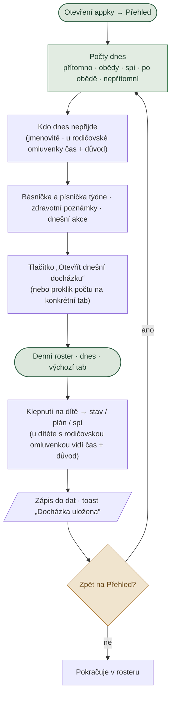
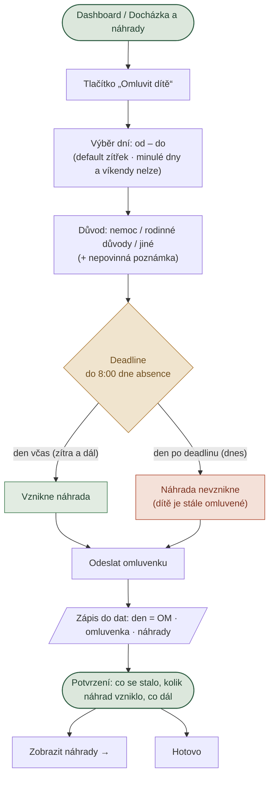
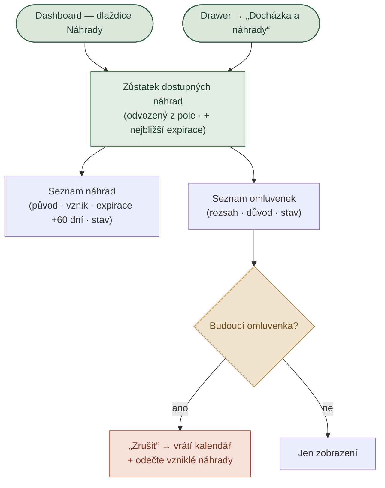
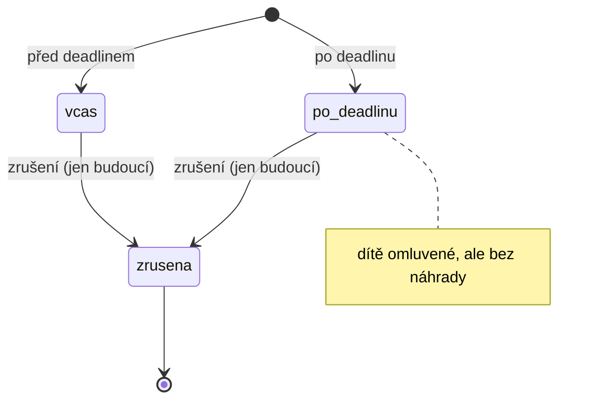
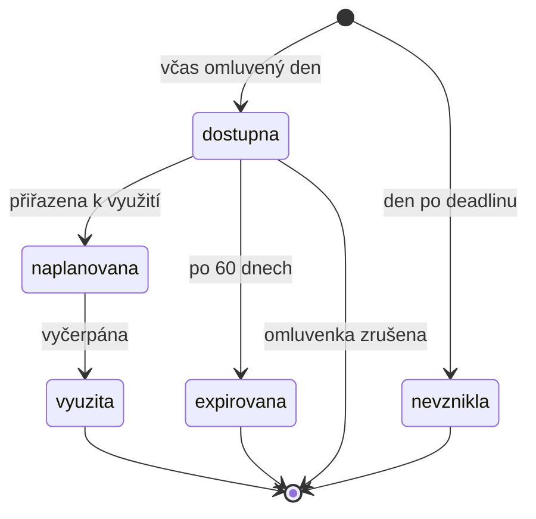

# User flows

Diagramy hlavních scénářů prototypu (viz `docs/BRIEF.md`, kap. 2). Pokryty Flow 1 v průvodcovské appce (fáze 2) a Flow 2/3 v rodičovské (fáze 1); ostatní se doplní v dalších fázích. Diagramy odpovídají chování v kódu; objekty a stavy jsou popsané v `docs/objekty-systemu.md`.

Simulovaný čas je **středa 3. 6. 2026, 10:00**; omluvit lze do **8:00 dne absence**.

> GitHub vykresluje mermaid bloky automaticky. Lokálně použij náhled s podporou mermaid (VS Code rozšíření apod.).

---

## Flow 1 — Průvodce zapisuje docházku

Průvodce otevře appku a rovnou vidí dnešek; do denního rosteru je jedním klepnutím. Zdroj chování: `src/scripts/pruvodce/screens/prehled.js` (dashboard), `src/scripts/pruvodce/screens/dochazka.js` (roster). Počty se odvozují ze stejných funkcí jako docházka (`counts()`), nejsou natvrdo.

**Odloženo z Flow 1 (vědomě):** offline režim a stavy synchronizace (žádná fronta změn, žádný indikátor „bez signálu“) — potvrzení uložení je jen toast. Třídnice / zápis dne (čtení a doplňování zápisů z předchozího dne na dashboardu) je budoucí objekt, zatím není ani placeholder. Viz decision-log, fáze 2.

Ověřovací otázky briefu: průvodce po otevření vidí počty bez jediného kliku · do docházky je jedním klepnutím · je jasné, kdo nepřijde a proč.

---

## Flow 2 — Rodič omlouvá dítě

Z dashboardu jedním klikem. Deadline i vznik náhrady jsou vysvětlené před odesláním a znovu na potvrzení.

**Pravidlo:** Vícedenní omluvenka počítá náhradu **za každý den zvlášť** — včasné dny → `dostupna`, dny po deadlinu → `nevznikla`. Stav celé omluvenky se řídí prvním dnem (`vcas` / `po-deadlinu`).

Ověřovací otázky briefu: rodič funkci nehledá v menu (je na dashboardu) · rozumí deadlinu (box před odesláním) · ví, jestli vznikla náhrada (potvrzení) · ví, co bude dál.

---

## Flow 3 — Rodič kontroluje náhrady

Zůstatek a seznam na jednom místě — bez dohledávání na faktuře nebo ve zprávách.

Ověřovací otázky briefu: rodič chápe počet dostupných náhrad · rozumí, za co vznikly (původ) · ví, dokdy je může využít (expirace) · nemusí dohledávat jinde.

---

## Stavové modely objektů

Stavy, ze kterých později vzniknou badge, potvrzení a empty states. Plánování/čerpání náhrady (výběr náhradního dne) je zatím mimo rozsah — stav `naplanovana` je jen v seed datech.

### Omluvenka

### Náhrada

Do zůstatku se počítá jen stav `dostupna` — počet se všude odvozuje z pole (`dostupne()`), nikde není uložený jako číslo.

Seed data: Eliška pokrývá všech 5 stavů náhrad + 2 omluvenky (budoucí `vcas`, minulá `po-deadlinu`); Matěj 1 dostupnou.
